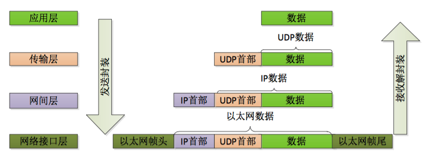
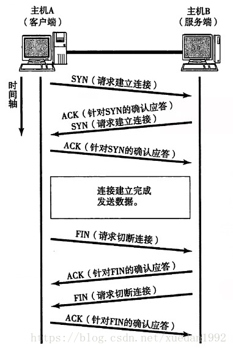

# 网络协议

### 网络模型
* OSI七层模型
    > OSI(Open System Interconnect，开放式系统互联)

#|名称|作用
--|--|:--
7|应用层|应用层是最接近终端用户的OSI层，这就意味着OSI应用层与用户之间是通过应用软件直接相互作用的
6|表示层|这一层的主要功能是定义数据格式及加密
5|会话层|会话层建立、管理和终止表示层与实体之间的通信会话
4|传输层|传输层向高层提供可靠的端到端的网络数据流服务
3|网络层|这层对端到端的包传输进行定义，他定义了能够标识所有结点的逻辑地址，还定义了路由实现的方式和学习的方式
2|数据链路层|数据链路层通过物理网络链路提供可靠的数据传输
1|物理层|负责最后将信息编码成电流脉冲或其它信号用于网上传输


> **OSI的七层模型**虽然概念清楚、理论完整，但它既复杂又不实用，受到行业的诟病，而由技术人员自己开发的**TCP/IP四层模型**却获得了更为广泛的应用

* TCP/IP四层模型
    > TCP/IP(transfer control protocol/internet protocol,传输控制协议/网际协议)，借鉴了 OSI 的概念建立 TCP/IP 模型

#|名称|作用
--|--|:--
4|应用层|应用层负责处理应用程序的逻辑
3|传输层|为两台主机上的应用程序提供端到端（end to end）的通信
2|网络层|实现数据包的选路和转发
1|数据链路层|实现了网卡接口的网络驱动程序，以处理数据在物理媒介（比如以太网、令牌环等）上的传输



* OSI和TCP/IP对比

<table>
    <thead>
        <tr>
            <th>OSI七层模型</th>
            <th>TCP/IP四层模型</th>
            <th>对应网络协议</th>
        </tr>
    </thead>
    <tbody>
        <tr>
            <td>应用层（Application）</td>
            <td rowspan="3">应用层</td>
            <td>HTTP、TFTP, FTP, NFS, WAIS、SMTP</td>
        </tr>
        <tr>
            <td>表示层（Presentation）</td>
            <td>Telnet, Rlogin, SNMP, Gopher</td>
        </tr>
        <tr>
            <td>会话层（Session）</td>
            <td>SMTP, DNS</td>
        </tr>
        <tr>
            <td>传输层（Transport）</td>
            <td>传输层</td>
            <td>TCP, UDP</td>
        </tr>
        <tr>
            <td>网络层（Network）</td>
            <td>网络层</td>
            <td>IP, ICMP, ARP, RARP, AKP, UUCP</td>
        </tr>
        <tr>
            <td>数据链路层（Data Link）</td>
            <td rowspan="2">数据链路层</td>
            <td>FDDI, Ethernet, Arpanet, PDN, SLIP, PPP</td>
        </tr>
        <tr>
            <td>物理层（Physical）</td>
            <td>IEEE 802.1A, IEEE 802.2到IEEE 802.11</td>
        </tr>
    </tbody>
</table>


### 网络协议
#### TCP 协议
TCP协议（Transmission Control Protocol，传输控制协议）为应用层提供可靠的、面向连接的和基于流（stream）的服务。TCP协议使用**超时重传**、**数据确认**等方式来确保数据包被正确地发送至目的端，因此TCP服务是可靠的。使用TCP协议通信的双方必须先建立TCP连接（**三次握手**），当通信结束时，双方必须关闭连接以释放这些内核数据（**四次挥手**），TCP有以下几个特点：

* 有状态的长连接：客户端发起连接请求，服务端响应并建立连接，连接会一直保持直到一方主动断开。
* 主动性：建立起与客户端的连接后，服务端可主动向客户端发起调用。
* 信息安全性：同样可以使用 SSL 证书进行信息加密，访问时用 WSS 。
* 跨域：默认支持跨域。



> 三次握手与四次挥手都是为了解决网络信道不可靠的问题，在不可靠的信道上建立可靠的连接
* SYN (Synchronization) 请求
* ACK (Acknowledgment) 确认
* FIN (Finish)  结束

#### UDP协议
UDP协议（User Datagram Protocol，用户数据报协议）则与TCP协议完全相反，它为应用层提供不可靠、无连接和基于数据报的服务。“不可靠”意味着UDP协议无法保证数据从发送端正确地传送到目的端

> TCP与UDP的区别：
1. 基于连接与无连接；
2. 对系统资源的要求（TCP较多，UDP少）；
3. UDP程序结构较简单；
4. 流模式与数据报模式 ；
5. TCP保证数据正确性，UDP可能丢包，TCP保证数据顺序，UDP不保证。

#### HTTP/HTTPS协议
> HTTP 协议(Hypertext Transfer Protocol:超文本传输协议)是建立在TCP协议之上的一种应用，
http/https协议可以总结几个特点：

* 短连接（一次性、无状态）：`客户端发起请求->服务端响应->结束`
    > 虽然http1.1能通过`keep-alive`实现**长连接**，但依然只能单向发起请求
* 单向：只允许Browser/UA（UserAgent）向WebServer发出请求（服务器不能主动向客户端发起响应）
    > 只能通过**轮询**的方式实现实时通信
* 信息安全性：得在服务器添加 SSL 证书，访问时用 HTTPS。
* 跨域限制：默认不允许跨域请求其它服务器资源
    > 可通过CORS实现http跨域
* 头部数据过大
    > http数据包的头部数据量往往很大（通常有400多个字节），但是真正被服务器需要的数据却很少（有时只有10个字节左右），这样的数据包在网络上周期性的传输，难免对网络带宽是一种浪费

#### Websocket协议
WebSocket 是为了满足基于 Web 的日益增长的**实时通信**需求而产生的。WebSocket 协议在2008年诞生，2011年成为国际标准。目前几乎所有现代浏览器都已经支持

### WebSocket 实时通信
* 应用场景
    * 聊天室/微信群消息
    * 视频弹幕
    * 股票的实时行情
    * 火车票的剩余票数
    * 网络游戏
    * 协同编辑
    * 导航
* 实现方案
    * 轮询(Polling)
        > 在传统的 Web 中，要实现实时通信，通用的方式是采用 HTTP 协议不断发送请求（轮询）。但这种方式只能由客户端发起请求，通常会发送很多无用请求，既浪费带宽，又消耗服务器 CPU 资源
    * 长轮询（Long Polling）
        > 长轮询是对轮询的改进版，客户端发送HTTP给服务器之后，
        * 如果服务器端有新的数据，立即发回给客户端
        * 如果没有新消息，服务器把这个请求保持住，等待有新的数据到来时，再来响应这个请求
    * websocket
        > 支持客户端和服务器端的双向通信，能实客户端与服务器主动发送


    


HTTP、WebSocket 等应用层协议，都是基于 TCP 协议来传输数据的，连接和断开，都要遵循 TCP 协议中的**三次握手**和**四次挥手**，只是在连接之后发送的内容不同，或者是断开的时间不同

### 使用WebSocket

#### 服务端
* 安装ws模块
    ```bash
        npm install ws
    ```
* 开启WebSocket服务器
    ```javascript
        let socketServer = require('ws').Server;
        let wss = new socketServer({
            port: 1001
        });
    ```
* 配合express开启服务器
    ```javascript
        let express = require('express');
        let http = require('http');
        let ws = require('ws');
        let app = express();
        // 利用http连接express
        let server = http.Server(app);
        let wss = new ws.Server({
            // 利用http连接websocket
            server,
            // port:1001
        });
        // 利用http监听端口
        server.listen(3000)
    ```
* 监听服务器事件
    * connection：连接监听，当客户端连接到服务端时触发该事件，返回连接客户端对象
* 监听客户端事件
    * close：连接断开监听，当客户端断开与服务器的连接时触发
    * message：消息接受监听，当客户端向服务端发送信息时触发该事件
    * send: 向客户端推送信息


#### 客户端
>WebSocket是HTML5开始提供的一种基于 TCP 的协议，连接建立以后，客户端和服务器端就可以通过 TCP 连接直接交换数据

* 实例化 WebSocket ，参数为 WebSocket 服务器地址，建立与服务器的连接
* 事件
    -  open：当网络连接建立时触发该事件
    -  close：当服务端关闭时触发该事件
    -  error：当网络发生错误时触发该事件
    -  message：当接收到服务器发来的消息的时触发的事件，也是通信中最重要的一个监听事件
* 方法
    - close(): 在客户端断开与服务端的连接;
    - send()：向服务端推送消息

```javascript
    //连接 socket 服务器
    var socket = new WebSocket('ws://localhost:1001');
   
    //监听 socket 的连接
    socket.onopen = function(){
       document.write("服务已连接 ws://localhost:1001");
    }
   
    //监听服务端断开
    socket.onclose = function(){
        document.write("服务已断开");
        socket = null;
    }

    //监听服务端异常
    socket.onerror = function(){
        document.write("服务错误");
        socket = null;
    }

    //监听服务端广播过来的消息
    socket.onmessage = function(msg){
        var msgObj = JSON.parse(msg.data);
        if(msgObj.status == 0){
            $('<p>' + msgObj.nickname + '[' + msgObj.time + ']退出聊天</p>').appendTo('.msgList');
        } else{
            $('<p>' + msgObj.nickname + '[' + msgObj.time + ']：' + msgObj.message + '</p>').appendTo('.msgList');
        }
    }

    var sendMessage = function(_mess){
        if(socket){
            var myDate = new Date();
            var now = myDate.getMonth() + '-' + myDate.getDate() + ' ' + myDate.getHours() + ':' + myDate.getMinutes() + ':' + myDate.getSeconds();             
            
            var mesObj = {
                nickname: $('#nickName').val(),
                message: _mess || $('#mesBox').val(),
                time: now
            }
            //向服务端发送消息
            socket.send(JSON.stringify(mesObj));
        }           
    }

```