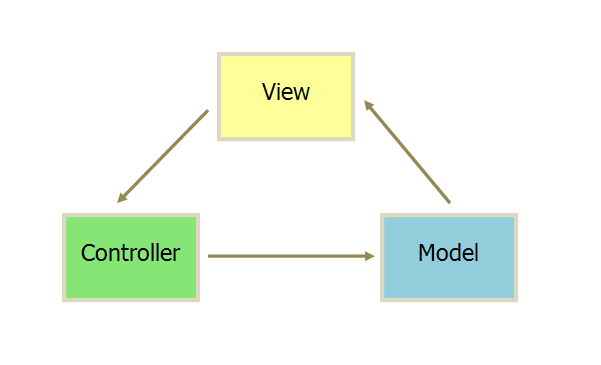
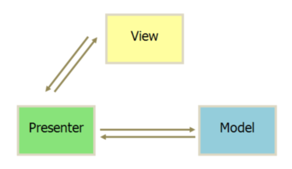
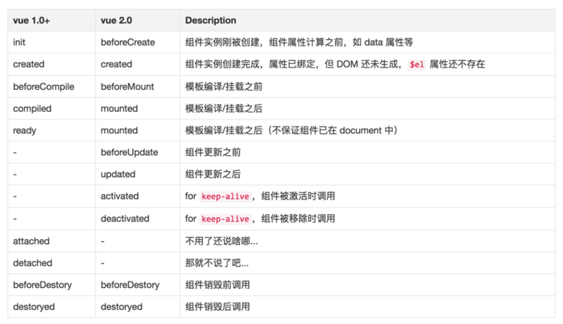

[TOC]

# VUE

> 读音：[vjuː]，类似于 view

## 了解VUE

Vue是中国的大神尤雨溪（Evan You）开发的一套用于构建用户界面的**渐进式框架** ，基于**MVVM模式**，以**数据驱动**和**组件化**的思想构建，采用**自底向上增量开发**的设计。相比于其它框架，提供了更加简洁、更易于理解的API，使得我们能够快速地上手并使用Vue.js

* 渐进式框架：不强求你一次性接受并使用它的全部功能特性，可根据需求选择性地用你想用的功能特性，更灵活（如Vue，可以根据业务需求选项是是否使用路由、状态管理、项目构建等特性）。
    > 渐进式框架是相对于一些完整框架而言（如：Angular, Ember等），这些框架集成了所有的功能，当你使用这些框架时，意味着你不得不使用这个框架所有特性

### 前端框架历史

* jquery阶段（2006）
    - 特点：节点操作简单易用，浏览器兼容
* angular阶段（2009）
    - 特点：MVC模式，双向数据绑定，依赖注入
* backbone阶段（2010）
    * 特点：MVP模式
* react阶段（2013）
    - 特点：virtual DOM，性能上碾轧angularJS
* vue阶段（2014）
    - 特点：综合angular与react的优点，MVVM模式，是一款高性能高效率的框架


## 安装和引入
* script标签引入
    * 官网下载：https://cn.vuejs.org/js/vue.js
    * cdn
        ```html
            <script src="https://cdn.jsdelivr.net/npm/vue@2.5.17/dist/vue.js"></script>
        ```
* npm
    >能很好和webpack等打包工具配合使用
* 命令行工具：vue-cli
    >快速的搭建基于webpack的开发环境

## 版本
* 按环境分
    * 开发版(development)：`vue.js`
    * 生产版(production)：`vue.min.js`
* 按构建版本分
    * 完整版: `vue.js`
    * 运行时版：`vue.runtime.js`
* 按模块分
    * commonJS: `vue.common.js`
    * ESModule: `vue.esm.js`
    * UMD: `vue.js`


## 使用

### 实例化：`new Vue(options)`

```js
    // <div id="app"></div>
    var model = { name: 'laoxie' }

    var vm = new Vue({
        // 关联视图层
        el: '#app',
        // 关联数据层
        data: model
    });
```

### 架构模式
> 复杂的软件必须有清晰合理的架构，更容易开发、维护和测试，所以需要进行分层

* MVC
    > 最经典的架构分层，MVC模式的意思是，软件可以分成三个部分。

    * Model（模型）：数据处理
    * View（视图）：数据展示
    * Controller（控制器）：业务逻辑处理（M和V之间的连接器）

    

    1. View 传送指令到 Controller（用户发送指令）
    3. Controller 完成业务逻辑后，要求 Model 改变状态
    2. Model 将新的数据发送到 View，用户得到反馈
    
    * 缺点：依赖复杂
        * View 依赖Controller和Model
        * Controller依赖View和Model

* MVP
    > MVP 架构模式是 MVC的改良模式（改进Controller， 把Model和View完全隔离开）

    * Model
    * View
    * Presenter 可以理解为松散的Controller，其中包含了视图的 UI 业务逻辑，所有从视图发出的事件，都会通过代理给 Presenter 进行处理；同时，Presenter 也通过视图暴露的接口与其进行通信。

    

* MVVM
    > 由MVP模式演变而来

    * Model
    * View
    * ViewModel  它是View和Model的粘合体，负责View和Model的交互和协作，它采用双向数据绑定：View的变动，通过ViewModel自动反映在Model层中，反之亦然

    

    - 核心思想：用户只需要关注Model的变化，让MVVM框架利用自己的机制去自动更新DOM，从而把开发者从操作DOM的繁琐中解脱出来！

### 响应式属性
> 特点：监听数据变化，当数据被修改时，会自动更新页面视图

* 对象响应式原理：存储器属性（getter & setter）
    > 属性特性
    ```js
        let laoxie = {
            firstName:'lao',
            lastName:'xie',
            get fullName(){
                return this.firstName + ' ' + lastName
            },
            set(val){
                let username = val.split(' ');
                this.firstname = username[0];
                this.lastName = username[1];
            }
        }
    ```
* 数组响应式原理：重写数组的原型，并在原型中添加以下方法
    * push()
    * unshift()
    * shift()
    * pop()
    * splice()
    * sort()
    * reverse()
    > 操作数组时调用以上方法会自动刷新视图

* 如何设置响应式属性
	* 设置data初始化数据
        > 实例化时，Vue会遍历data中所有属性，通过`Object.defineProperty()`把它们设置为存储器属性（getter & setter），并写入Vue实例
	* `Vue.set(target,key,val)`： 向**响应式系统**中的对象添加属性并自动渲染视图
		> 注意：target可以是数据或对象，但不能是 Vue 实例，或者 Vue的根数据对象
	
* 编程思维的改变
    * 以前：节点操作 -> 渲染页面
    * 现在：修改数据 -> Vue -> 渲染页面

### 页面渲染

#### 数据绑定
* 单向数据绑定
    * {{}}：插值表达式
        > 差值表达式中应当放置一些简单的运算（data中的数据、函数执行、三元运算等），对于任何复杂逻辑，你都应当使用**计算属性**操作完成后再写入插值表达式
    * v-text：显示文本
    * v-html：显示html内容
    * v-bind：
        * 可绑定任意属性
            ```html
                
                <!-- 简写  -->
                
            ```
        * 对style与class的绑定
            > 在将 v-bind 用于 class 和 style 时，Vue做了专门的增强。表达式结果的类型除了字符串之外，还可以是对象或数组
       
            ```html
                <div class="static"
                    v-bind:class="{ active: isActive, 'text-danger': hasError }"
                    v-bind:style="{ color: activeColor, fontSize: fontSize + 'px' }">
                </div>
                <script>
                    new Vue({
                        data: {
                            isActive: true,
                            hasError: false,
                            activeColor: 'red',
                            fontSize: 30
                        }
                    })
                </script>
                <!-- 最终结果：<div class="static active" style="color:red;font-size:30px"></div> -->
            ```
        * v-bind无参数绑定对象
            ```html
                <div v-bind="{username:'laoxie',age:18,gender:'男'}"></div>
                <!-- 等效于 -->
                <div v-bind:username="laoxie" v-bind:age="18" v-bind:gender="男"></div>
            ```
        * 动态参数
            > 2.6.0开始支持，包括v-bind,v-on等
            ```html
                <div v-bind:[attr]="value"></div>
            ````
* 双向数据绑定：v-model
    > 一般用于表单元素，与表单元素的`value`属性进行绑定，并监听`input`事件
    * **双向数据绑定原理**
        * Model -> View:    setter
        * View -> Model:    事件
    * v-model替代方案:
        > v-model = v-bind:value + v-on:input
        ```js
            <input v-model="count" />
            // 等效于
            <input v-bind:value="count" v-on:input="count=$event.target.value">
            // 组件中使用v-model相当于在组件中绑定`v-bind:value`和`v-on:input`
            <mycomponent v-model="count'/>
            // 等效于
            <mycomponent v-bind:value="count" v-on:input="count=$event" />
         ```
    * checkbox复选框使用v-model
        * 初始值为数组，与value属性绑定
        * 初始值为其他，与checked属性绑定(true,false)
            * true-value：设置选中时的值
            * false-value：设置补选中时的值
    * 修饰符
        * lazy      input触发改成change触发
        * number    输出值为number类型
        * trim      自动清楚前后空格
        
### 列表渲染
* v-for
    > 可遍历Array | Object | number | string | Iterable

    * 遍历数组
    ```html
        <li v-for="(value, index) in arr">{{value}}</li>
    ```
    * 遍历对象
    ```html
        <tr v-for="(value, key, index) in obj">
            <td>{{index+1}}</td>
            <td>{{key}}-{{value}}</td>
        </tr>
    ```
* key：主要用在Vue的虚拟DOM算法（diff算法），在新旧nodes对比时辨识VNodes
    * 如果不使用key，Vue对相同的元素进行展示排序等操作时，遵循“就地复用”原则，因为这样更加高效，性能更好
    * 但对于依赖子组件状态或临时 DOM 状态 (如：表单输入值、复选框选中等)的列表，会出现操作混乱的问题，
    * 指定key属性后，意为去掉“就地复用”特性（建议尽可能在使用 v-for 时提供 key）
    * 在组件中使用v-for，必须提供key属性

### 条件渲染

* v-show
* v-if
* v-else
* v-else-if
* 三元运算

### 事件绑定：v-on
> 格式：v-on:事件类型.修饰符="事件处理函数"

* 事件修饰符
    - stop
    - prevent
    - capture
    - self  只当在 event.target 是当前元素自身时触发处理函数(e.target === e.currentTarget)
    - once 事件将只会触发一次
* 按键修饰符
    * 直接使用键码来作为按键修饰符
    ```html
        <!-- 只有在 `keyCode` 是 13 时调用 `vm.submit()` -->
        <input v-on:keyup.13="submit">
    ```
    * 使用别名作为按键修饰符
        + left,up,right,down
        + enter
        + tab
        + esc
        + space


## 总结

### 类：Vue
* 类属性（静态属性）
* 类方法（静态方法）

### 实例：vm
* 实例属性
    * 内置属性
        > 以`$`开头
        - $data: 同 data
        - $el: 同 el节点
        - $refs
        - $parent
        - $children
        - $root
    * 私有属性
        > 以`_`开头
    * 自定义属性
        > Vue实例化时，会遍历data/computed/methods中所有属性/方法，并写入Vue的实例
* 实例方法与原型方法
    * 数据处理
        - `$watch()`：监听数据变化，同watch配置选项
        - `$set()`：`Vue.set()`的别名
    * 事件操作
        - `$on()`     ：监听当前实例上的自定义事件
        - `$off()`    ：移除自定义事件监听器
        - `$emit()`   ：触发当前实例上的事件
    * 关于生命周期
        * `$mount()`  ：
            > 如果实例化时未配置 el 选项，则它处于“未挂载”状态，没有关联的 DOM 元素。可以使用 vm.$mount() 手动地挂载
        * `$destroy()`
            > 完全销毁一个实例。清理它与其它实例的连接，解绑它的全部指令及事件监听器。触发 beforeDestroy 和 destroyed 的钩子
        * `$nextTick(callback)`
            > 同Vue.nextTick()，将回调延迟到下次 DOM 更新循环之后执行，返回promise对象
        * `$forceUpdate()` 强制刷新组件

### options配置选项
* 关于DOM节点
    * el（类型：Selector|Element)
        > Vue实例的挂载目标（实例中所有的属性/方法可直接在el中直接使用），挂载元素会被 Vue 生成的 DOM 替换
    * template（类型：String）
        > 模板，如果不指定则以ele所在元素作为模板
        * Selector：提取内容到template标签，并指定选择器
    - render（类型：Function）
        > template的代替方案，允许你发挥 JavaScript 最大的编程能力。该渲染函数接收一个 createElement(tagName,props,children) 方法作为第一个参数用来创建 VNode
        * 优先级：render > template > el.outerHTML

        ```js
            new Vue({
                //...
                el:'#app',
                template:`<div>{{username}}</div>`,
                render:createElement=>{
                    return createElement('h1',{title:'标题',class:'title'},'文章标题')
                }
            })
        ```
* 关于数据
    - data（类型：Object|Function)
        > Vue实例化时，它将data中所有的属性添加到**响应式系统**中，当这些数据改变时，视图会进行重渲染
    - computed（类型：Object)
        > 计算属性，本质是getter&getter，计算属性是基于它们的响应式依赖进行缓存的，所以对于需要复杂逻辑或运算才能得到的值，应当使用计算属性
    - methods（类型：Object)
        >一般用于编写公共方法、事件处理函数等，方法中的this指向实例，所以不应该使用箭头函数来定义 method 函数
    - watch（Object）
        > 监听属性（Function），监听的值被修改时会自动调用函数，一种比computed更加通用的方式，当需要在数据变化时**执行异步**或**开销较大的操作**时，这个方式是最有用的
        ```js
            watch: {
                username: function (val, oldVal) {
                    console.log('new: %s, old: %s', val, oldVal)
                }
            }
        ```


### 常用指令directive
> 指令是带有 v-* 前缀的特殊html属性，完整格式：`v-指令名:参数.修饰符="值"`

* v-bind
* v-on
* v-text
* v-html
* v-model
* v-for
* v-show
* v-if
* v-else
* v-else-if

#### 自定义指令
>Vue虽然内置了很多指令，但我们仍然能根据需要扩展自己的指令

* 分类
  * 全局指令
      * 格式：`Vue.directive(name,option)`
      * 参数
          * name：指令名字，使用格式：v-name
          * option
              * Object：放钩子函数
              * Function：默认为bind和update的钩子函数
  * 局部指令
      格式：`directives: {name: option}`
* 钩子函数（了解）
    * bind：初始化时执行（默认）
    * inserted：元素插入页面时执行
    * update：所在模板更新时执行
    * componentUpdated：所在模板完成一次更新周期时调用
    * unbind：指令与元素解绑时执行
    * 参数
        * el    指令所绑定的元素，可以用来直接操作 DOM
        * binding   一个对象，包含以下案例中的属性
        * vnode
        * oldVnode
            > 仅在update 和 componentUpdated 钩子中可用
* 使用：`v-name`

```javascript
    Vue.directive('test', {
      bind: function (el, binding, vnode) {

        //binding参数如下
        el.innerHTML =
          'name: '       + JSON.stringify(binding.name) + '<br>' + //指令名
          'value: '      + JSON.stringify(binding.value) + '<br>' + //指令值
          'arg: '        + JSON.stringify(binding.arg) + '<br>' + //指令参数，
          'modifiers: '  + JSON.stringify(binding.modifiers) + '<br>' //指令修饰符
          'expression: ' + JSON.stringify(binding.expression) + '<br>' + //字符串形式的指令表达式
      }
    });
```


## 生命周期

<!--  -->


### 生命周期函数（钩子函数）

>在某个时刻被自动执行的函数，生命周期函数中的this指向实例，以下为v1.x与v2.x钩子函数对照表：



* beforeCreate()
    * 初始化完成，但没有往实例添加属性
    * 应用：可以在这加个loading事件 
* created()
    * 实例已经创建完成之后被调用
    * 应用：ajax请求，还做一些初始化，实现函数自执行
* beforeMount()
    * 可以获取节点，但数据未渲染
    * 应用：在这发起ajax请求，拿回数据，配合路由钩子做一些事情
* mounted()
    * 实例挂载到 DOM，完成数据双向绑定
    * 应用：节点操作
* beforeUpdate()
    * 数据有更新时调用，可以在这个钩子中进一步更改状态，这不会触发附加的重渲染过程
* updated()
    * 更新节点完毕
    * PS：要注意避免在此期间更改数据，因为这可能会导致死循环
* beforeDestroy()
* destroyed()
    > 执行destroy()后，不会改变已生成的DOM节点，但后续就不再受vue控制了
    * 应用：清除定时器、延迟器、取消ajax请求等


---

**【案例】**

* tab标签切换
* todolist待办事项

**【练习】**

* 表格操作
    > 表格的增删改
* 全选反选案例
    > 复选框实现表格的选中与取消
* 商品列表排序
    > 价格排序，销量排序，热度排序
