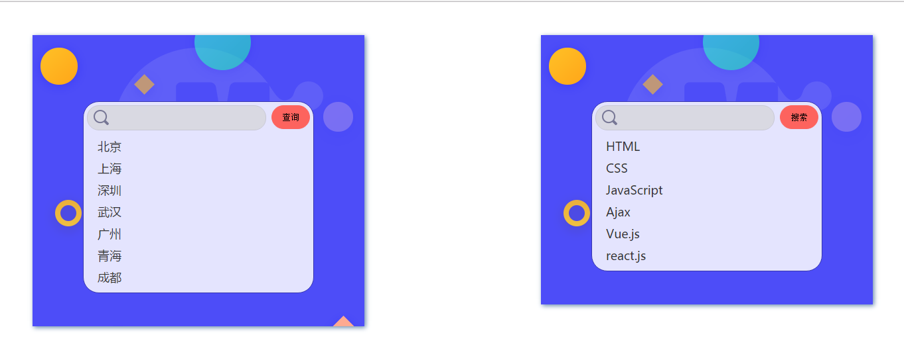
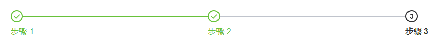

[TOC]

# 组件Component

## 了解组件
组件是 Vue最强大的功能之一，组件可以扩展 HTML 元素，封装可重用的代码。组件系统让我们可以用独立可复用的小组件来构建大型应用，几乎任意类型的应用的界面都可以抽象为一个组件树


### 组件优点
  * 代码复用
  * 便于维护
  * 更好地分工


## 组件定义

组件是可复用的 Vue 实例，所以定义组件时拥有与实例化Vue几乎一样的选项，如 data、computed、watch、methods 以及生命周期钩子等，与Vue实例不同点如下：
* `el`为根实例特有选项，组件中不能使用该选项
* `data`选项必须为函数类型

### 组件要求
* data必须为Function类型
* 每个组件必须只有一个根元素
* 注册时组件名可以是`kebab-case`或`PascalCase`，但在html页面上使用时，必须写成遵循W3C 规范中的自定义组件名 (字母全小写或包含一个连字符)

### 全局组件: `Vue.component(name,options)`
全局组件可在任意位置使用

```js
    Vue.component('my-component', {
      // ... options ...
      template:'<p>我是全局组件</p>'
    })
```

### 局部组件: `components:{name:options}`
局部组件只能在当前组件中使用

```js
    Vue.component('parentComponent', {
      template:`<div>
        <child />
      </div>`,
      components: {
        Child:{
            data(){
                return {
                    name:'我是局部组件'
                }
            },
            template: '<h1>hello, {{name}}</h1>'
        }
      }
    })
```

### 组件渲染选项
* `template`模板
* `render(createElement)`渲染函数
  * `createElement(tag,options,children)`，一个用于创建虚拟节点的函数
    * tag:  一个 HTML 标签名、组件选项对象
    * options: 一个与模板中 attribute 对应的数据对象（包含 `props`,`attrs`,`on`,`key`等属性）
    * children: 子级虚拟节点（或文本虚拟节点）

> 注意：当组件选项中有`render`渲染函数时，直接使用render函数渲染DOM，否则将`template`模板编译生成渲染函数，然后再渲染DOM树

### 使用组件
定义一个组件，相当于自定义一个html标签，使用时必须遵循W3C标准的**小写字母**或**连字符**（驼峰必须使用连字符）

```html
    <div id="app">
      <my-component></my-component>
      <parent-component></parent-component>
    </div>
```

> 注意：由于Vue 只有在浏览器解析和标准化 HTML 后才能获取模板内容，所以把组件嵌套在某些特定的元素（如table,ul,ol,select等）上时，会导致解析错误

```html
  <table>
    <tbody>
      <!-- 解析错误：因为tbody中只能是tr -->
      <my-row></my-row>
    </tbody>
  </table>
```

> 以上解析的结果为，tr被解析到了table外面，解决方式也很简单，利用特殊的`is`属性实现

```html
  <table>
    <tbody>
      <tr is="my-row"></tr>
    </tbody>
  </table>
```

### 组件层级
* $parent     父组件
* $children   子组件
* $root       根组件

## 组件通讯
每个组件的作用域都是独立的，不能直接在某个组件中使用其它组件的数据，必须以下通讯方式实现数据共享

### 父组件->子组件： props
1. 父组件操作：给子组件定义属性，并传递父组件数据
2. 子组件操作：通过`props`选项接收父组件数据，props中的数据会自动写入组件实例

> 注意：props属性会自动成为组件实例的属性（可通过`this.xx`访问）
> **单向数据流**：prop传递是单向的，当父组件的属性变化时，将传导给子组件，但反过来不行（故不能在子组件修改父组件的数据）

```js
    // 子组件代码
    Vue.component('mycomponent', {
      props: ['mytitle','msg'],
      template: '<div>{{ mytitle }}</div>'
    })

    // 父组件代码
    <mycomponent mytitle="静态数据" v-bind:msg="message" test="test"></mycomponent>

    let vm = new Vue({
      data:{
        message:'hello laoxie'
      }
    })
```

* 非prop属性：不通过props声明的属性（如上面的test属性）
  > 此类属性会自动成为组件根节点的属性（可通过`{inheritAttrs: false}` 关闭）

* prop数据验证
  > 对传入的prop属性进行校验，如：数据类型、必填、默认值等

  ```js
    Vue.component('my-component', {
      props: {
        // 基础的类型检查 (`null` 匹配任何类型)
        propA: Number,
        // 多个可能的类型
        propB: [String, Number],
        // 必填的字符串
        propC: {
          type: String,
          required: true
        },
        // 带有默认值的数字，无prop属性传入时，默认得到100
        propD: {
          type: Number,
          default: 100
        },
        // 带有默认值的对象
        propE: {
          type: Object,
          // 对象或数组默认值必须从一个工厂函数获取
          default: function () {
            return { message: 'hello' }
          }
        },
        // 自定义验证函数
        myscore: {
          validator: function (value) {
            // 这个值必须大于等于60，否则报错
            return val>=60
          }
        }
      }
    })
  ```

### 子组件->父组件： 

* 方式一：父组件方法传递到子组件执行，并回传数据

* 方式二：自定义事件（推荐）
  1. 父组件操作：给子组件自定义事件（如:`v-on:show`），并使用父组件的方法做为事件处理函数（handle）
  2. 子组件操作：通过`$emit()`触发自定义事件并传递数据
  ```js
      // 父组件代码
      <mycomponent v-on:show="handle" />

      // 子组件代码
      // 该代码会触发父组件的事件处理函数handle，从而实现数据传递
      this.$emit('show',100)
  ```

### 兄弟组件通信（了解）
> 组件A与组件B具有共同父级的兄弟元素

* 方式一
  1. 组件A -> 父组件
  2. 父组件 -> 组件B
* 方式二：状态提升
  > 把共享数据放到他们共同的父级
  

### 深层级组件通讯：

#### Bus事件总线
> 利用一个Vue实例作为事件载体配合事件实现数据共享

- 接受数据方：自定义事件，用于接收数据
- 发送数据方：$emit()触发自定义事件，并传递数据

```js
    // 需求：A组件发送数据到B组件

    // 定义Bus事件总线做为通讯桥梁
    let Bus = new Vue();

    //发送数据方: 组件A
    let comA = {
        data(){
            return {
              msg:'I am A'
            }
        },
        template:`<div>
            <p>{{msg}}</p>
            <button @click="send">传数据到B组件</button>
        </div>`,
        methods:{
            send(){
                Bus.$emit('data',this.msg);
            }
        }
    }

    // 接受数据方：组件B
    let comB = {
        data:()=>({
            msg:'I am B'
        }),
        mounted(){
            Bus.$on('data',val=>this.msg = val)
        },
        template:`<div><p>{{this.msg}}</p></div>`
    }

```

#### Provide/Inject依赖注入
> 父组件通过`provide`向其所有子孙后代注入一个依赖，后代组件可以通过`inject`把依赖注入到当前组件实例中

* **provide**：`Object | () => Object`
* **inject**：`Array<string> | { [key: string]: string | Symbol | Object }`

```js
  // 父级组件提供 'foo'
  var Provider = {
    provide: {
      foo: 'bar'
    },
    // ...
  }

  // 后代组件注入 'foo'
  var Child = {
    inject: ['foo'],
    created () {
      console.log(this.foo) // => "bar"
    }
    // ...
  }
```

> PS: `provide` 和 `inject` 主要在开发高阶插件/组件库时使用。并不推荐用于普通应用程序代码中

### 通过组件层级操作数据
#### 子组件修改父组件数据
> PS：Vue遵循**单向数据流**原则，不允许在子组件中直接修改props传入的父组件数据（应遵循谁的数据谁修改原则），如实际开发中有修改需求，可使用以下变通的方式实现

* 方式一：通过父组件实例`$parent`修改
* 方式二：自定义事件系统
  > 利用`$emit()`方法触发父组件函数来达到修改的效果
* 方式三：sync修饰符
  1. 父组件操作：给子组件用v-bind绑定数据时使用sync修饰符`v-bind:xx.sync="数据"`
  2. 子组件操作：调用`this.$emit('update:xx',val)`触发修改

  ```html
    <div id="app">
      <mybutton v-bind:color.sync="color"></mybutton>
    </div>
    <script>
      new Vue({
        el:'#app',
        data:{
            color:'red'
        },
        components:{
          mybutton:{
            template:'<button @click="changeColor">改变字体颜色</button>',
            methods:{
              changeColor(){
                this.$emit('update:color','#58bc58');
              }
            }
          }
        },
      })
      </script>
  ```

#### 父组件修改子组件数据
* 方式一：通过`$children`获取子组件实例进行修改
  > 需要通过索引值获取
* 方式二：通过`ref`获取子组件实例进行修改（推荐）
  > ref用在组件上返回该组件对应的实现

### 插槽内容
> 在父组件生成html结构并传递到子组件渲染，子组件使用`<slot/>`来承载传入的内容，实现组件可定制化

* 默认插槽: `<slot/>`
    ```html
      <!-- 子组件my-component模板代码 -->
      <div>
        <slot></slot>
      </div>

    <!-- 父组件代码： -->
    <my-component>
    <!-- 这里的html结构会自动写入上面的slot所在的位置 -->
      <h4>列表标题</h4>
      <ul>
        <li></li>
        <li></li>
      </ul>
    </my-component>
  ```

* 具名插槽：给`<slot/>`组件命名（设置name属性）
  > 通过指令 `v-slot:name`（简写 `#name`）指定显示到哪个插槽（v-slot指令只在`<template/>`标签中使用）
  ```html
    <!-- 子组件：给插槽命名（无命名为默认插槽） -->
      <div>
        <slot name="header">该插槽的默认内容（不使用插槽时默认显示）</slot>
        <slot></slot>
        <slot name="footer"></slot>
      </div>

    <!-- 父组件：指定内容到某个插槽 -->
    <!-- Vue2.6+用法 -->
    <my-component>
      <template v-slot:header>这里的内容显示到name为header的插槽</template>
      <span>这里的内容显示到默认插槽</span>
      <template #footer>这里的内容显示到name为footer的插槽</template>
    </my-component>

    <!-- 老式用法（不推荐） -->
    <my-component>
      <span slot="header">这里的内容显示到name为header的插槽</span>
      <span>这里的内容显示到默认插槽</span>
      <span slot="footer">这里的内容显示到name为footer的插槽</span>
    </my-component>
  ```

* 作用域插槽
  > 把子组件中的数据通过`<slot/>`传递到父组件，实现特殊定制

  ```html
    <!-- 子组件：给slot添加属性 -->
    <div class="box">
      <slot :msg="msg" :username="username"></slot>
      <slot name="footer" title="播放器" :player="player"></slot>
    </div>

    <!-- 父组件：通过v-slot接收数据 -->
    <my-component>
      <!-- Vue2.6+用法 -->
      <template v-slot:default="props">{{props.msg}}，{{props.username}}</template>
      <template #footer="foot">{{foot.title}}，{{foot.player}}</template>

      <!-- 老式用法（不推荐） -->
      <div slot-scope="props">{{props.msg}}，{{props.username}}</div>
    </my-component>
  ```

### 提取组件公共代码：mixins
> 混入 (mixins) 一般用于组件选项的复用（所有属性与组件选项一致）。并以一定的合并规则混入到组件中

* 全局mixin：`Vue.mixin(options)`
  > 全局注册一个混入，会影响后面所有创建的每个 Vue 实例/组件（影响较大，一般用于插件编写）

  ```js
    Vue.mixin({
      created: function () {
        // created生命周期函数会混入到下面的Vue实例中,且不会影响原来的选项
        console.log('global mixin:',this.username)
      }
    });

    new Vue({
      data:{
        username:'laoxie'
      },
      created(){
        console.log('app.username',this.username)
      }
    });
  ```

* 局部mixins：`mixins:[mymixin]`
  >一般用于提取多个组件的公有部分配置

  ```js
    var mixin = {
      data: function () {
        return {
          message: 'hello',
          foo: 'abc'
        }
      }
    }

  new Vue({
    mixins: [mixin],
    data: function () {
      return {
        message: 'goodbye',
        bar: 'def'
      }
    },
    created: function () {
      console.log(this.$data);// => { message: "goodbye", foo: "abc", bar: "def" }
    }
  })

  ```

## 内置组件

* `<component>` 动态组件（根据条件渲染不同的内容）
    * is：指定渲染的组件，可以是组件名称或组件配置

  ```html
    <component v-bind:is="currentTabComponent"></component>
  ```
* `<keep-alive>` 缓存组件
  > 把切换出去的组件保留在内存中，可以保留组件的状态（包括输入内容与滚动条位置），当keep-alive包裹的组件存在条件渲染时（如v-if、动态组件、路由切换等），会缓存组件实例，而不是销毁它们，从而页面效果保留

    * include（String/Regexp） ： 指定缓存组件名
    * exclude（String/Regexp） ： 指定不缓存的组件名

  ```html
    <keep-alive>
      <component v-bind:is="currentTabComponent"></component>
    </keep-alive>
  ```

* `<slot>` 内容分发（[详情](#插槽内容)） 

### 过渡动画
* `<transition>`  单个元素动画
* `<transition-group>` 多个元素动画，默认解析为一个span标签


#### 属性
* name : 过渡类名前缀（默认：v）
  > 如设置`name="fade"`，过渡类名变成：`fade-enter` / `fade-enter-active` / `fade-leave` / `fade-leave-active`
* css  : 是否使用 CSS 过渡类（默认：true）。设置为 false，将只通过组件事件触发注册的 JavaScript 钩子。

* 自定义过渡类名（可配合animate.css框架实现过渡效果）
  * `enter-class`
  * `enter-active-class`
  * `enter-to-class`
  * `leave-class`
  * `leave-active-class`
  * `leave-to-class`
  ```html
    <transition
      enter-active-class="bounceIn"
      leave-active-class="bounceOut"
    >
    </transition>
  ```

#### 触发动画场景

> Vue会自动检测是否设置css动画或JavaScript钩子，并在下列情形中添加进入/离开过渡效果

* 条件渲染 (使用 v-if)
* 条件展示 (使用 v-show)
* 动态组件 (component或router-view)
* 组件根节点

#### 动画类型
* 进场动画：隐藏->显示
* 出场动画：显示->隐藏


#### CSS过渡

* 通过CSS过渡类名
  > 组件过渡过程中，默认会有四个CSS类名自动进行切换，会有如下四个CSS类名：

  * v-enter：进入过渡的开始状态，元素被插入时生效，只应用一帧后立即删除；
  * v-enter-active：进入过渡的结束状态，元素被插入时就生效，在过渡过程完成之后移除；
  * v-leave：离开过渡的开始状态，元素被删除时触发，只应用一帧后立即删除；
  * v-leave-active：离开过渡的结束状态，元素被删除时生效，离开过渡完成之后被删除；


#### JavaScript过渡
> 通过内置事件实现过渡动画效果，可以利用第三方动画库（如：velocity.js,jquery等）实现动画效果

```html
    <transition
      v-on:before-enter="beforeEnter"
      v-on:enter="enter"
      v-on:after-enter="afterEnter"
      v-on:enter-cancelled="enterCancelled"
      v-on:before-leave="beforeLeave"
      v-on:leave="leave"
      v-on:after-leave="afterLeave"
      v-on:leave-cancelled="leaveCancelled"
    >
    </transition>
```

```javascript
    methods: {
      // 过渡进入
      // 设置过渡进入之前的组件状态
      beforeEnter: function (el) {
        // ...
      },
      // 设置过渡进入完成时的组件状态
      enter: function (el, done) {
        // ...
        // 调用done表示动画完成
        done()
      },
      // 设置过渡进入完成之后的组件状态
      afterEnter: function (el) {
        // ...
      },
      enterCancelled: function (el) {
        // ...
      },
      // 过渡离开
      // 设置过渡离开之前的组件状态
      beforeLeave: function (el) {
        // ...
      },
      // 设置过渡离开完成时地组件状态
      leave: function (el, done) {
        // ...
        done()
      },
      // 设置过渡离开完成之后的组件状态
      afterLeave: function (el) {
        // ...
      },
      // leaveCancelled 只用于 v-show 中
      leaveCancelled: function (el) {
        // ...
      }
    }
```

---

**【案例】**

* 组件化todolist
* 编写一个按钮组件
* 开发goTop 返回顶部组件

**【练习】**

* 实现一个可复用的搜索组件
  > 支持界面定制，支持ajax
  

* 封装一个列表组件实现商品展示
  > 支持排序，分页操作
* 封装一个step步骤条组件



